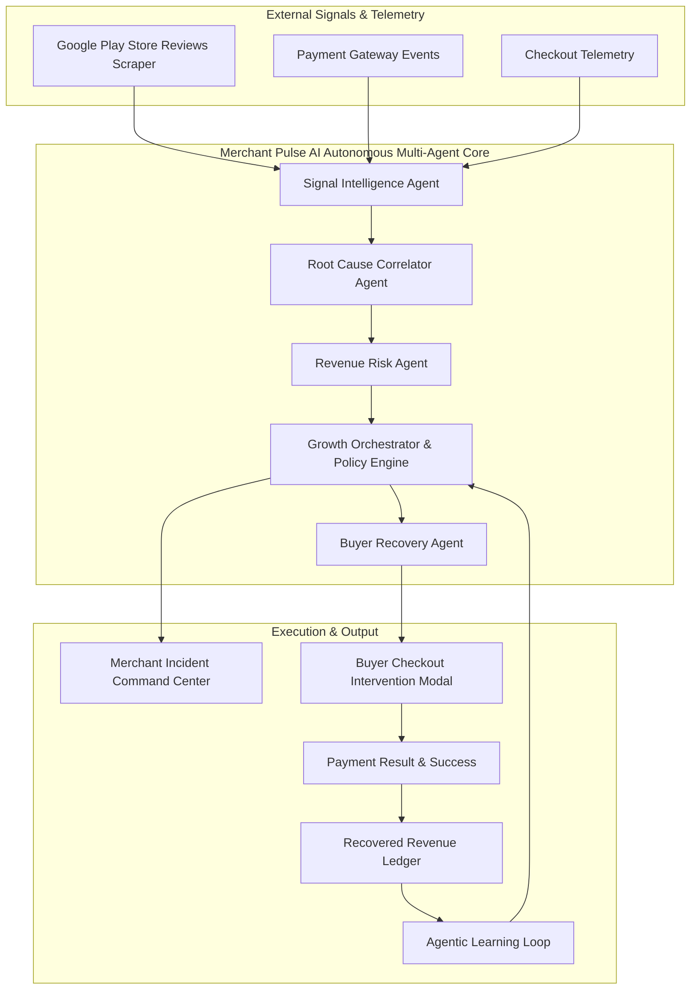

# Merchant Pulse AI — Autonomous Revenue Intelligence & Recovery Platform

> **From customer signal to recovered revenue.**

[](https://razorpay.com)
[]()
[]()
[]()

---

## 🚀 Pitch & One-Line Summary

**Merchant Pulse AI is an autonomous AI revenue command center for Razorpay merchants that detects emerging customer and payment problems in minutes (MTTD: 2m 41s), correlates external Play Store feedback with payment telemetry, quantifies revenue at risk, and autonomously intervenes during buyer checkouts to recover lost transactions.**

---

## 💡 Problem & Value Proposition

Traditional payment reporting tells merchants **what happened after lost revenue is already unrecoverable**. 

* **Fragmented Signals**: Merchants receive Play Store reviews, customer complaints, and payment gateway logs in isolated silos.
* **Delayed Detection**: An outage in a specific UPI bank gateway or checkout bug can silently degrade conversion for hours before manual ops teams notice.
* **Lost Sales**: Buyers experiencing checkout friction abandon transactions permanently without context-aware assistance.

### The Merchant Pulse Solution

Merchant Pulse AI connects customer voice with payment telemetry in real time to enforce the central autonomous loop:

```
DETECT → DIAGNOSE → PREDICT → ACT → RECOVER → LEARN
```

1. **Detect**: Scrapes real-time Google Play Store reviews and customer feedback.
2. **Diagnose**: Correlates Play Store review complaints with payment gateway failure rates & checkout conversion drops.
3. **Predict**: Quantifies exact revenue at risk ($\text{Revenue At Risk} = \text{Affected Txns} \times \text{AOV} \times \text{Recoverability}$) and projects 2-hour business impact.
4. **Act**: Creates an evidence-backed incident and activates the Buyer Recovery Agent.
5. **Recover**: Intervenes during buyer payment friction to route customers from degraded gateways (e.g., UPI bank timeouts) to healthy alternatives (Credit/Debit Card).
6. **Learn**: Updates strategy efficiency stats (e.g. *Card switching produces 2.3× higher conversion than UPI retries*).

---

## 🏗️ Architecture & Multi-Agent Design



### Multi-Agent Roster

| Agent Name | Primary Purpose | Inputs | Key Output |
| :--- | :--- | :--- | :--- |
| **Signal Intelligence Agent** | Monitor incoming customer signals & cluster emerging issues | Play Store reviews, App feedback, time-window review streams | Categorized sentiment, severity tags, payment keyphrases |
| **Root Cause Agent** | Correlate customer complaints with payment telemetry | Review complaints + Gateway failure rates + Conversion drops | Confirmed root cause & evidence list |
| **Revenue Risk Agent** | Translate technical friction into business impact | Affected checkouts, AOV, historical recoverability | Revenue at risk ($\text{₹1,10,880}$) & 2-hour forecast |
| **Growth Orchestrator** | Enforce policy guardrails & manage incident lifecycle | Risk matrix, merchant policy rules | Incident creation, merchant alerts, agent activation |
| **Buyer Recovery Agent** | Intervene during buyer checkout payment friction | Failed checkout context, method health, attempt count | Intelligent method switch recommendation (`SWITCH_PAYMENT_METHOD`) |

---

## 🛠️ Technology Stack

* **Frontend**: Next.js 14+ (App Router), React 18, TypeScript, Tailwind CSS, Lucide React Icons, Recharts Analytics.
* **Backend**: Python 3.10+, FastAPI, Uvicorn, Async SQLAlchemy, SQLite (`aiosqlite`), Pydantic v2.
* **Scraper**: `google-play-scraper` (Real-time live Google Play Store review extraction).
* **AI Engine**: Modular `LLMProvider` architecture with **Zero-Dependency Deterministic Hackathon Demo Mode** (`AI_MODE=mock`) and OpenAI/Gemini support (`AI_MODE=real`).

---

## ⚡ Quickstart & Local Setup

### 1. Clone & Setup Backend

```bash
cd backend
python -m pip install -r requirements.txt
python main.py
```
The FastAPI backend server will start at `http://localhost:8000`.

### 2. Setup Frontend

```bash
cd frontend
npm install
npm run dev
```
The Next.js Merchant SaaS Dashboard will start at `http://localhost:3000`.

---

## 🎯 The 3-Minute Hackathon Demo Walkthrough

1. Open the **Merchant SaaS Dashboard** (`http://localhost:3000/dashboard`). View baseline metrics (UPI success rate 95%, ₹0 revenue at risk).
2. Click **🚀 1-Click Simulate UPI Incident** in the top control bar:
   - Injects 25 realistic Play Store reviews reporting UPI payment timeouts.
   - Degrades UPI gateway health to 82% and drops checkout conversion.
   - Triggers multi-agent pipeline: **Signal Agent** $\rightarrow$ **Root Cause Agent** $\rightarrow$ **Revenue Risk Agent** $\rightarrow$ **Growth Orchestrator**.
   - Creates **Critical Incident #1042** showing **₹1,10,880 Revenue at Risk** with an **MTTD of 2m 41s**.
3. Click **Buyer Checkout Demo** (`http://localhost:3000/checkout`) to simulate a customer buying headphones for ₹4,999:
   - Select **UPI** and click **Pay ₹4,999**.
   - Payment fails due to simulated bank gateway timeout.
   - **Buyer Recovery Agent Modal** appears dynamically:
     > *"Your UPI payment appears to be experiencing bank timeouts right now. Rather than retrying UPI, you can complete your ₹4,999 payment instantly using Credit/Debit Card."*
   - Click **Try Credit/Debit Card (Recommended 🟢)** $\rightarrow$ Payment succeeds!
4. Return to the **Merchant Dashboard**:
   - **Revenue Recovered** instantly increments by **+₹4,999**.
   - **AI Recoveries Counter** increments.
   - **Multi-Agent Execution Feed** logs the successful recovery event.

---

## 💳 Razorpay Positioning

Merchant Pulse AI is designed as an **Autonomous Intelligence & Orchestration Layer** that sits on top of payment gateways like **Razorpay**. While Razorpay provides robust payment retry APIs, Merchant Pulse AI answers the critical business questions:
* *Why are customers suddenly failing to pay?*
* *Is this customer complaint connected to a gateway degradation?*
* *How much revenue is currently at risk?*
* *Which alternative payment method will maximize buyer recovery conversion right now?*

---

## 📝 License

Built for the **Razorpay Hackathon** — *AI Growth & Agentic Commerce*.
