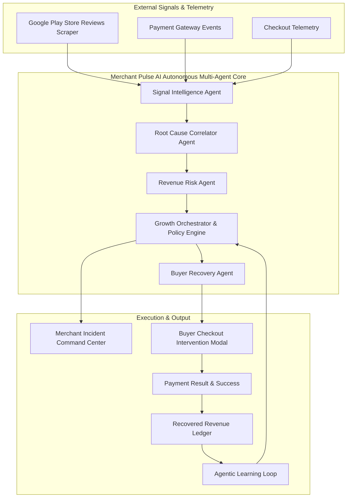

# Merchant Pulse AI — Autonomous Revenue Intelligence & Recovery Platform

> From customer signal to recovered revenue.

---

## Executive Overview

Merchant Pulse AI is an autonomous revenue intelligence and recovery command center designed for digital merchants and payment platforms. The platform continuously monitors customer sentiment from external channels (such as Google Play Store reviews), correlates unstructured feedback with real-time checkout telemetry, quantifies revenue at risk, and autonomously intervenes during buyer checkout friction to recover lost transactions.

By bridging customer signals and payment gateway diagnostics, Merchant Pulse AI resolves the critical lag between customer friction and operational resolution, achieving a Mean Time to Detect (MTTD) of 2 minutes and 41 seconds.

---

## Problem Statement and Business Value

Traditional payment reporting operates reactively, informing merchants of lost revenue after conversion has already failed permanently. 

### Core Industry Challenges

* **Isolated Signal Silos**: Customer complaints on app stores, support tickets, and gateway log telemetry exist in disconnected systems.
* **Delayed Detection**: Gateway degradations (such as specific UPI bank 504 timeouts or issuer bank declines) silently impair conversion for hours before manual operations teams identify the cause.
* **Irrecoverable Cart Abandonment**: Buyers encountering payment friction abandon checkout permanently without real-time assistance or alternative guidance.

### The Merchant Pulse Value Proposition

Merchant Pulse AI closes this operational loop through a continuous six-stage autonomous cycle:

```
DETECT -> DIAGNOSE -> PREDICT -> ACT -> RECOVER -> LEARN
```

1. **Detect**: Continuously extracts customer reviews and feedback from app stores and telemetry endpoints.
2. **Diagnose**: Correlates customer complaint clusters with live payment gateway health metrics and conversion dropoffs.
3. **Predict**: Quantifies exact monetary revenue at risk (`Revenue At Risk = Affected Transactions * Average Order Value * Recoverability Factor`).
4. **Act**: Raises structured reliability incidents, notifies merchant stakeholders via automated email digests, and initializes recovery agents.
5. **Recover**: Dynamically intervenes at the buyer checkout modal during payment friction, guiding buyers from degraded payment options to healthy alternatives.
6. **Learn**: Feeds recovery outcome data back into policy engines to optimize routing efficiency over time.

---

## Key Features and Functional Modules

### 1. Payment Reliability Incident Command Center
* Real-time monitoring of payment gateway health across UPI, Credit/Debit Cards, Net Banking, and Wallets.
* Automatic classification of incidents by severity (`CRITICAL`, `HIGH`, `MEDIUM`, `LOW`).
* On-demand inspection of agent execution history and traces, detailing exact agent reasoning, prompt outputs, and state transitions.

### 2. Autonomous Buyer Recovery Engine
* In-line intervention modal embedded directly into the checkout flow.
* Detects transaction failures (e.g., UPI bank gateway 504 timeouts) and recommends friction-free alternative payment channels (e.g., Credit/Debit Card).
* Direct conversion tracking recording recovered transaction value (`+₹4,999`) into the merchant ledger.

### 3. Customer Signal & Review Intelligence
* Automated scraping and ingestion of Google Play Store reviews.
* Natural language categorization into sentiment tiers, rating distributions, and payment-related complaint flags.
* Ability to reset review caches and trigger real-time Play Store polling.

### 4. Automated Email Alerting & Digest System
* Automated dispatch of critical incident warnings and daily feedback digests using Resend API and SMTP integration.
* Includes executive sentiment summaries, top recurring friction vectors, and recommended merchant actions.

### 5. SLA & Revenue Churn Analytics
* Tracking of Mean Time to Detect (MTTD), Mean Time to Resolve (MTTR), and SLA compliance rates.
* Financial projections of revenue loss prevented through automated interventions.

---

## Architecture and Multi-Agent Design



### Multi-Agent Roster

| Agent Name | Primary Purpose | Inputs | Key Output |
| :--- | :--- | :--- | :--- |
| **Signal Intelligence Agent** | Monitor incoming customer signals and cluster emerging issues | Play Store reviews, App feedback, time-window review streams | Categorized sentiment, severity tags, payment keyphrases |
| **Root Cause Agent** | Correlate customer complaints with payment telemetry | Review complaints + Gateway failure rates + Conversion drops | Confirmed root cause and evidence list |
| **Revenue Risk Agent** | Translate technical friction into business impact | Affected checkouts, AOV, historical recoverability | Revenue at risk calculations and 2-hour forecast |
| **Growth Orchestrator** | Enforce policy guardrails and manage incident lifecycle | Risk matrix, merchant policy rules | Incident creation, merchant alerts, agent activation |
| **Buyer Recovery Agent** | Intervene during buyer checkout payment friction | Failed checkout context, method health, attempt count | Intelligent method switch recommendation |

---

## End-to-End Workflow

1. **Telemetry Ingestion**: The system pulls customer reviews via the Play Store scraper service while simultaneously receiving checkout event streams.
2. **Signal Classification**: Unstructured text is processed by the Signal Intelligence Agent to identify payment keywords (e.g., "bank timeout", "money deducted", "OTP failed").
3. **Root Cause Analysis**: The Root Cause Correlator Agent matches complaint surges against real-time gateway success rates.
4. **Impact Quantification**: The Revenue Risk Agent computes estimated revenue loss over a 2-hour window.
5. **Incident Generation & Alerting**: The Growth Orchestrator creates an active incident record and dispatches an email notification to the merchant.
6. **Checkout Recovery**: When a buyer encounters a payment failure on the checkout page, the Buyer Recovery Agent evaluates gateway health and displays a contextual recovery modal suggesting a higher-converting alternative.
7. **Ledger Update**: Upon successful payment completion, the transaction is marked recovered, updating the dashboard metrics in real time.

---

## Future Roadmap and System Expansion

* **Autonomous Payment Gateway Routing Engine**: Direct integration with payment gateway APIs to automatically adjust checkout routing weights dynamically without manual intervention.
* **Dynamic Discount and Nudge Recovery**: Autonomous application of small recovery discounts (e.g., 5% off) for high-value carts experiencing payment friction.
* **Omnichannel Merchant Notifications**: Expansion of email alerts to include real-time WhatsApp Business API and Slack webhook dispatches.
* **Cross-Merchant Anomaly Intelligence**: Aggregating anonymized telemetry across merchants to detect widespread bank-level UPI outages across India before official gateway status page updates.

---

## Technology Stack

* **Frontend**: Next.js 16 (App Router), React 19, TypeScript, Vanilla CSS, Lucide React Icons, Recharts Analytics.
* **Backend**: Python 3.11+, FastAPI, Uvicorn, Async SQLAlchemy, SQLite (`aiosqlite`), Pydantic v2.
* **AI & Agent Infrastructure**: Custom LLM Provider supporting OpenAI, Google Gemini, and CrewAI frameworks with fallback mock modes.
* **External Services**: Resend Email API, `google-play-scraper`.

---

## Repository Structure

```
.
├── backend/
│   ├── agents/          # Autonomous multi-agent implementations
│   ├── providers/       # LLM provider abstractions (Gemini, OpenAI, Mock)
│   ├── routers/         # FastAPI REST endpoints (incidents, reviews, checkout)
│   ├── services/        # Scraper, Email, and Background workers
│   ├── main.py          # Application entrypoint
│   └── config.py        # Environment configuration
├── frontend/
│   ├── src/app/         # Next.js App Router pages (dashboard, incidents, signals)
│   ├── src/components/  # Layout, Navbar, and UI components
│   └── src/lib/         # API client utilities
├── .env.example         # Environment template
├── Dockerfile           # Backend container specification
└── README.md            # System documentation
```

---

## Quickstart and Local Setup

### 1. Prerequisites
* Python 3.10+
* Node.js 18+

### 2. Backend Setup

```bash
# Navigate to backend directory
cd backend

# Install dependencies
pip install -r requirements.txt

# Start backend server
python main.py
```
The FastAPI backend server will initialize at `http://localhost:8000`.

### 3. Frontend Setup

```bash
# Navigate to frontend directory
cd frontend

# Install dependencies
npm install

# Start Next.js development server
npm run dev
```
The Next.js Merchant SaaS Dashboard will initialize at `http://localhost:3000`.

---

## Production Deployment

### Backend (Render / Docker)
* **Build Command**: `pip install -r backend/requirements.txt`
* **Start Command**: `uvicorn backend.main:app --host 0.0.0.0 --port $PORT`
* **Environment Variables**: `PYTHONPATH=.`, `AI_MODE=real`, `GEMINI_API_KEY=<key>`, `RESEND_API_KEY=<key>`

### Frontend (Vercel)
* **Root Directory**: `frontend`
* **Build Command**: `npm run build`
* **Environment Variables**: `NEXT_PUBLIC_API_URL=https://<your-backend-url>/api`

---

## License

Built for the **Razorpay Hackathon** — *AI Growth & Agentic Commerce*.
