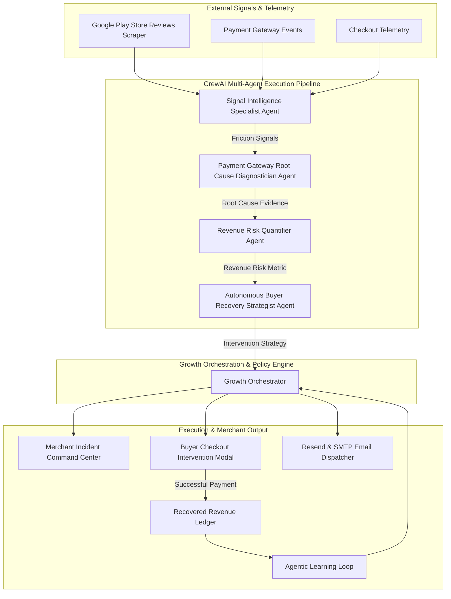
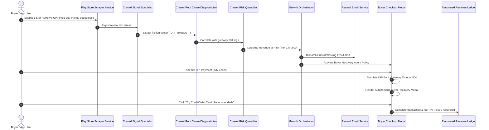

# Merchant Pulse AI — Autonomous Revenue Intelligence & Recovery Platform

> From customer signal to recovered revenue.

---

## Executive Overview

Merchant Pulse AI is an autonomous revenue intelligence and recovery command center built for digital merchants and payment platforms. The platform continuously monitors customer sentiment from external channels (such as Google Play Store reviews), correlates unstructured feedback with real-time checkout telemetry, quantifies revenue at risk, and autonomously intervenes during buyer checkout friction to recover lost transactions.

By bridging customer signals and payment gateway diagnostics via a specialized CrewAI multi-agent pipeline, Merchant Pulse AI resolves the critical lag between customer friction and operational resolution, achieving a Mean Time to Detect (MTTD) of 2 minutes and 41 seconds.

---

## Problem Statement and Business Value

Traditional payment analytics tools operate reactively, reporting lost revenue after conversion has already failed permanently.

### Core Industry Challenges

* **Isolated Signal Silos**: Customer complaints on app stores, support tickets, and gateway log telemetry exist in disconnected systems.
* **Delayed Detection**: Gateway degradations (such as specific UPI bank 504 timeouts or issuer bank declines) silently impair conversion for hours before manual operations teams identify the cause.
* **Irrecoverable Cart Abandonment**: Buyers encountering payment friction abandon checkout permanently without real-time assistance or alternative guidance.

### The Merchant Pulse Value Proposition

Merchant Pulse AI closes this operational loop through a continuous six-stage autonomous cycle:

```
DETECT -> DIAGNOSE -> PREDICT -> ACT -> RECOVER -> LEARN
```

1. **Detect**: Continuously extracts customer reviews and feedback from app stores and telemetry endpoints using the `google-play-scraper` service.
2. **Diagnose**: Correlates customer complaint clusters with live payment gateway health metrics and conversion dropoffs using the CrewAI Root Cause Diagnostician.
3. **Predict**: Quantifies exact monetary revenue at risk (`Revenue At Risk = Affected Transactions * Average Order Value * Recoverability Factor`).
4. **Act**: Raises structured reliability incidents, notifies merchant stakeholders via automated Resend HTML email digests, and initializes recovery agents.
5. **Recover**: Dynamically intervenes at the buyer checkout modal during payment friction, guiding buyers from degraded payment options to healthy alternatives.
6. **Learn**: Feeds recovery outcome data back into policy engines to optimize routing efficiency over time.

---

## CrewAI Multi-Agent Architecture

Merchant Pulse AI integrates **CrewAI** as its core multi-agent execution and orchestration engine. The system organizes specialized AI agents into a sequential collaborative crew powered by `gemini/gemini-3.5-flash-lite` and OpenAI models with enterprise telemetry enabled.



### CrewAI Agent Roster and Task Specifications

| Agent Role | Goal & Backstory | Output / Artifact |
| :--- | :--- | :--- |
| **Signal Intelligence Specialist** | **Goal**: Detect emerging payment friction signals from Google Play Store reviews and webhook logs.<br>**Backstory**: Expert NLP signal analyst specializing in merchant checkout conversion and payment telemetry. | Categorized sentiment, severity tags, payment keyphrases (`UPI Timeout`, `App Freeze`). |
| **Payment Gateway Root Cause Diagnostician** | **Goal**: Correlate review complaint clusters with live payment gateway health and identify exact failure causes.<br>**Backstory**: Veteran fintech infrastructure engineer trained on Razorpay, UPI, and issuer bank degradation patterns. | Confirmed root cause diagnosis and evidence correlation. |
| **Revenue Risk Quantifier** | **Goal**: Estimate exact merchant revenue at risk and projected 2-hour financial impact.<br>**Backstory**: Financial risk quantitative modeling agent evaluating average order value and checkout leakage. | Quantified revenue at risk value (e.g. `INR 1,84,800`). |
| **Autonomous Buyer Recovery Strategist** | **Goal**: Formulate dynamic buyer checkout recovery interventions to save lost transactions.<br>**Backstory**: Agentic commerce growth agent specializing in dynamic payment method switching and checkout retry friction removal. | Actionable intervention strategy (`SWITCH_PAYMENT_METHOD` to Credit/Debit Card). |

---

## End-to-End System Sequence Diagram



---

## Key Functional Modules

### 1. Payment Reliability Incident Command Center
* Real-time monitoring of payment gateway health across UPI, Credit/Debit Cards, Net Banking, and Wallets.
* Automatic classification of incidents by severity (`CRITICAL`, `HIGH`, `MEDIUM`, `LOW`).
* **Agent Execution History & Trace Inspector**: Provides full transparency into agent execution steps, detailing exact prompts, model responses, and state transitions without cluttering the main dashboard.

### 2. Autonomous Buyer Recovery Engine
* In-line intervention modal embedded directly into the checkout flow.
* Detects transaction failures (e.g., UPI bank gateway 504 timeouts) and recommends friction-free alternative payment channels (e.g., Credit/Debit Card).
* Direct conversion tracking recording recovered transaction value (`+₹4,999`) into the merchant ledger.

### 3. Customer Signal & Review Intelligence
* Automated scraping and ingestion of Google Play Store reviews using `google-play-scraper`.
* Natural language categorization into sentiment tiers, rating distributions, and payment-related complaint flags.
* Ability to reset review caches and trigger real-time Play Store polling on demand.

### 4. Automated Email Alerting & Digest System
* Automated dispatch of critical incident warnings and daily feedback digests using Resend API and SMTP integration.
* Includes executive sentiment summaries, top recurring friction vectors, and recommended merchant actions.

### 5. SLA & Revenue Churn Analytics
* Tracking of Mean Time to Detect (MTTD), Mean Time to Resolve (MTTR), and SLA compliance rates.
* Financial projections of revenue loss prevented through automated interventions.

---

## Modular LLM & Agent Fallback Provider

Merchant Pulse AI features a resilient, multi-tiered AI architecture designed for production deployment and offline hackathon evaluation:

1. **CrewAI Framework Engine**: Executes multi-agent tasks using `gemini/gemini-3.5-flash-lite` and OpenAI models.
2. **Native Provider Abstraction**: Direct API calls to Google Gemini (`google-generativeai`) or OpenAI (`openai`).
3. **Zero-Dependency Deterministic Fallback Mode (`AI_MODE=mock`)**: Guarantees complete test coverage and deterministic demo execution without external API key dependencies.

---

## Technology Stack

* **Frontend**: Next.js 16 (App Router), React 19, TypeScript, Vanilla CSS, Lucide React Icons, Recharts Analytics.
* **Backend**: Python 3.11+, FastAPI, Uvicorn, Async SQLAlchemy, SQLite (`aiosqlite`), Pydantic v2.
* **Agent Framework**: CrewAI, CrewStudio Telemetry & Enterprise Tracing.
* **LLM Engine**: Google Gemini 3.5 Flash, OpenAI GPT-4o / GPT-3.5.
* **External Integrations**: Resend Email API, `google-play-scraper`.

---

## Repository Structure

```
.
├── backend/
│   ├── agents/          # Native multi-agent implementations (Signal, Root Cause, Risk, Recovery)
│   ├── crew/            # CrewAI pipeline integration (crew_pipeline.py)
│   ├── providers/       # LLM provider abstractions (Gemini, OpenAI, Mock)
│   ├── routers/         # FastAPI REST endpoints (incidents, reviews, checkout, recovery, SLA)
│   ├── services/        # Scraper, Email, and Background workers
│   ├── main.py          # Application entrypoint
│   └── config.py        # Environment configuration
├── frontend/
│   ├── src/app/         # Next.js App Router pages (dashboard, incidents, signals, transactions)
│   ├── src/components/  # Layout, Navbar, and UI components
│   └── src/lib/         # API client utilities
├── .env.example         # Environment template
├── Dockerfile           # Backend container specification
├── Procfile             # Cloud deployment specification
└── README.md            # System documentation
```

---

## API Specification Overview

| Method | Endpoint | Description |
| :--- | :--- | :--- |
| `GET` | `/api/dashboard/stats` | Fetch real-time merchant KPIs, gateway health, and revenue stats. |
| `GET` | `/api/incidents` | List active payment reliability incidents and agent execution logs. |
| `POST` | `/api/checkout/simulate` | Simulate buyer checkout attempt and trigger recovery intervention. |
| `GET` | `/api/reviews` | List ingested Play Store reviews with sentiment filtering. |
| `POST` | `/api/reviews/fetch-live` | Trigger real-time Play Store review extraction. |
| `POST` | `/api/reviews/trigger-warning` | Manually dispatch critical Resend email warning alert. |
| `POST` | `/api/demo/reset` | Reset demo state, review cache, and incident history. |

---

## Quickstart and Local Setup

### 1. Prerequisites
* Python 3.10+
* Node.js 18+

### 2. Backend Setup

```bash
# Navigate to backend directory
cd backend

# Install dependencies
pip install -r requirements.txt

# Start backend server
python main.py
```
The FastAPI backend server will initialize at `http://localhost:8000`.

### 3. Frontend Setup

```bash
# Navigate to frontend directory
cd frontend

# Install dependencies
npm install

# Start Next.js development server
npm run dev
```
The Next.js Merchant SaaS Dashboard will initialize at `http://localhost:3000`.

---

## Production Deployment

### Backend (Render / Docker)
* **Build Command**: `pip install -r backend/requirements.txt`
* **Start Command**: `uvicorn backend.main:app --host 0.0.0.0 --port $PORT`
* **Environment Variables**: `PYTHONPATH=.`, `AI_MODE=real`, `GEMINI_API_KEY=<key>`, `RESEND_API_KEY=<key>`

### Frontend (Vercel)
* **Root Directory**: `frontend`
* **Build Command**: `npm run build`
* **Environment Variables**: `NEXT_PUBLIC_API_URL=https://<your-backend-url>/api`

---

## License

Built for the **Razorpay Hackathon** — *AI Growth & Agentic Commerce*.
