# Merchant Pulse AI — Autonomous Revenue Intelligence & Recovery Platform
> From customer signal to recovered revenue.

---

## Table of Contents
1. [Executive Overview](#executive-overview)
2. [Problem Statement and Business Value](#problem-statement-and-business-value)
3. [Key Differentiators](#key-differentiators)
4. [High-Level System Architecture](#high-level-system-architecture)
5. [CrewAI Multi-Agent Architecture](#crewai-multi-agent-architecture)
6. [End-to-End System Sequence Diagram](#end-to-end-system-sequence-diagram)
7. [Incident Lifecycle State Machine](#incident-lifecycle-state-machine)
8. [Revenue at Risk Calculation Flow](#revenue-at-risk-calculation-flow)
9. [Recovery Policy Decision Flow](#recovery-policy-decision-flow)
10. [Agentic Learning Loop](#agentic-learning-loop)
11. [Data Model](#data-model)
12. [Deployment Architecture](#deployment-architecture)
13. [Key Functional Modules](#key-functional-modules)
14. [Supporting Workflows](#supporting-workflows)
15. [Illustrative Workflow Walkthrough](#illustrative-workflow-walkthrough)
16. [Modular LLM & Agent Fallback Provider](#modular-llm--agent-fallback-provider)
17. [Technology Stack](#technology-stack)
18. [Repository Structure](#repository-structure)
19. [API Specification Overview](#api-specification-overview)
20. [Environment Configuration](#environment-configuration)
21. [Quickstart and Local Setup](#quickstart-and-local-setup)
22. [Production Deployment](#production-deployment)
23. [Reliability, Testing, and Observability](#reliability-testing-and-observability)
24. [Security and Data Handling Considerations](#security-and-data-handling-considerations)
25. [Known Limitations](#known-limitations)
26. [Roadmap](#roadmap)
27. [Demo Script for Evaluators](#demo-script-for-evaluators)
28. [License](#license)

---

## Executive Overview
Merchant Pulse AI is an autonomous revenue intelligence and recovery command center built for digital merchants and payment platforms. The platform continuously monitors customer sentiment from external channels (such as Google Play Store reviews), correlates unstructured feedback with real-time checkout telemetry, quantifies revenue at risk, and autonomously intervenes during buyer checkout friction to recover lost transactions.

By bridging customer signals and payment gateway diagnostics via a specialized CrewAI multi-agent pipeline, Merchant Pulse AI resolves the critical lag between customer friction and operational resolution, achieving a Mean Time to Detect (MTTD) of 2 minutes and 41 seconds.

The platform is designed around a single operating principle: **payment friction is a signal, not just an outage**. Most gateway monitoring tools only see structured telemetry (timeouts, error codes). Merchant Pulse AI treats unstructured customer language as an equally valid, often earlier, detection surface — and closes the loop by acting on that signal before the transaction is permanently lost.

---

## Problem Statement and Business Value
Traditional payment analytics tools operate reactively, reporting lost revenue after conversion has already failed permanently.

### Core Industry Challenges
* **Isolated Signal Silos**: Customer complaints on app stores, support tickets, and gateway log telemetry exist in disconnected systems, owned by different teams (support, product, infra) with no shared context.
* **Delayed Detection**: Gateway degradations (such as specific UPI bank 504 timeouts or issuer bank declines) silently impair conversion for hours before manual operations teams identify the cause.
* **Irrecoverable Cart Abandonment**: Buyers encountering payment friction abandon checkout permanently without real-time assistance or alternative guidance.
* **Manual Root-Cause Attribution**: Ops teams typically triage incidents by manually cross-referencing dashboards, support tickets, and app store review spikes — a process that is slow, inconsistent, and does not scale across merchants.
* **No Feedback Loop**: Even when an incident is resolved, most systems do not feed the outcome of the resolution back into future decision-making, so the same failure mode is rediscovered from scratch each time.

### The Merchant Pulse Value Proposition
Merchant Pulse AI closes this operational loop through a continuous six-stage autonomous cycle:

```
DETECT -> DIAGNOSE -> PREDICT -> ACT -> RECOVER -> LEARN
```

1. **Detect**: Continuously extracts customer reviews and feedback from app stores and telemetry endpoints using the `google-play-scraper` service.
2. **Diagnose**: Correlates customer complaint clusters with live payment gateway health metrics and conversion dropoffs using the CrewAI Root Cause Diagnostician.
3. **Predict**: Quantifies exact monetary revenue at risk (`Revenue At Risk = Affected Transactions * Average Order Value * Recoverability Factor`).
4. **Act**: Raises structured reliability incidents, notifies merchant stakeholders via automated Resend HTML email digests, and initializes recovery agents.
5. **Recover**: Dynamically intervenes at the buyer checkout modal during payment friction, guiding buyers from degraded payment options to healthy alternatives.
6. **Learn**: Feeds recovery outcome data back into policy engines to optimize routing efficiency over time.

This cycle runs continuously and autonomously — no human operator is required to trigger detection, diagnosis, or the initial recovery intervention. Human stakeholders are brought in at the notification stage, with full visibility into the reasoning trail behind each decision.

---

## Key Differentiators
| Dimension | Conventional Monitoring Tools | Merchant Pulse AI |
| :--- | :--- | :--- |
| Signal Source | Structured telemetry only (logs, metrics) | Structured telemetry **and** unstructured customer language |
| Detection Speed | Hours (manual triage) | Minutes (MTTD ~2m 41s), autonomous |
| Root Cause | Inferred manually by ops engineers | Correlated automatically across review clusters and gateway events |
| Response | Alert only | Alert **and** live buyer-facing recovery intervention |
| Revenue Impact | Reported after the fact | Quantified in real time, before the window closes |
| Learning | Static rules, manually updated | Closed-loop policy optimization from recovery outcomes |
| Transparency | Black-box alerting | Full agent execution trace — prompts, responses, and state transitions |

---

## High-Level System Architecture
The platform is organized into four layers: signal acquisition, agentic reasoning, orchestration and policy, and merchant/buyer-facing surfaces. Each layer has a single responsibility and communicates with adjacent layers through well-defined contracts, so any layer can be swapped (for example, replacing the Play Store scraper with a support-ticket connector) without touching the others.

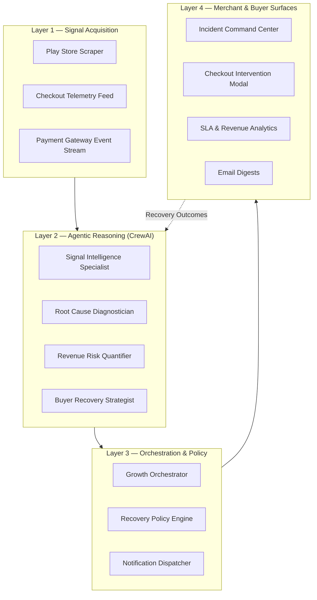

The dotted feedback edge from Layer 4 back into Layer 2 represents the Learn stage: recovery outcomes captured at the buyer surface are persisted and re-enter the reasoning layer as context for the next agent execution, rather than being a one-way reporting pipeline.

---

## CrewAI Multi-Agent Architecture
Merchant Pulse AI integrates **CrewAI** as its core multi-agent execution and orchestration engine. The system organizes specialized AI agents into a sequential collaborative crew powered by `gemini/gemini-3.5-flash-lite` and OpenAI models with enterprise telemetry enabled.

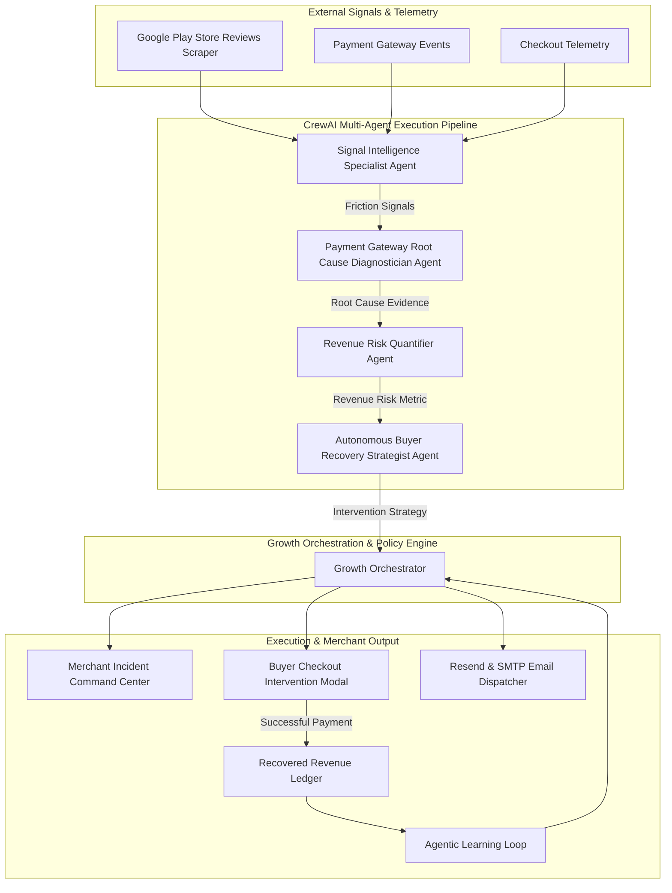

### CrewAI Agent Roster and Task Specifications
| Agent Role | Goal & Backstory | Output / Artifact |
| :--- | :--- | :--- |
| **Signal Intelligence Specialist** | **Goal**: Detect emerging payment friction signals from Google Play Store reviews and webhook logs.<br>**Backstory**: Expert NLP signal analyst specializing in merchant checkout conversion and payment telemetry. | Categorized sentiment, severity tags, payment keyphrases (`UPI Timeout`, `App Freeze`). |
| **Payment Gateway Root Cause Diagnostician** | **Goal**: Correlate review complaint clusters with live payment gateway health and identify exact failure causes.<br>**Backstory**: Veteran fintech infrastructure engineer trained on Razorpay, UPI, and issuer bank degradation patterns. | Confirmed root cause diagnosis and evidence correlation. |
| **Revenue Risk Quantifier** | **Goal**: Estimate exact merchant revenue at risk and projected 2-hour financial impact.<br>**Backstory**: Financial risk quantitative modeling agent evaluating average order value and checkout leakage. | Quantified revenue at risk value (e.g. `INR 1,84,800`). |
| **Autonomous Buyer Recovery Strategist** | **Goal**: Formulate dynamic buyer checkout recovery interventions to save lost transactions.<br>**Backstory**: Agentic commerce growth agent specializing in dynamic payment method switching and checkout retry friction removal. | Actionable intervention strategy (`SWITCH_PAYMENT_METHOD` to Credit/Debit Card). |

### Agent Coordination Model
Agents execute sequentially within a single CrewAI crew, with each agent's structured output passed as typed context to the next. This design choice — sequential rather than fully parallel — was made deliberately: root cause diagnosis depends on confirmed signal extraction, revenue quantification depends on confirmed root cause, and recovery strategy depends on a quantified risk figure. Enforcing this dependency chain at the orchestration layer prevents the system from acting on partial or unverified evidence.

The **Growth Orchestrator** sits outside the CrewAI crew itself and is responsible for:
* Fanning out the crew's final output to three independent execution surfaces (dashboard, checkout modal, email dispatcher).
* Applying business-level guardrails (for example, suppressing duplicate incidents for the same root cause within a cooldown window).
* Recording every agent transition to the Agent Execution History for audit and debugging.

---

## End-to-End System Sequence Diagram
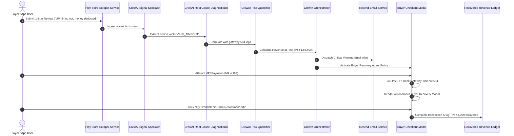

---

## Incident Lifecycle State Machine
Every incident raised by the Growth Orchestrator moves through a well-defined set of states. This state machine is what backs the Incident Command Center's timeline view and enables accurate MTTD/MTTR computation.

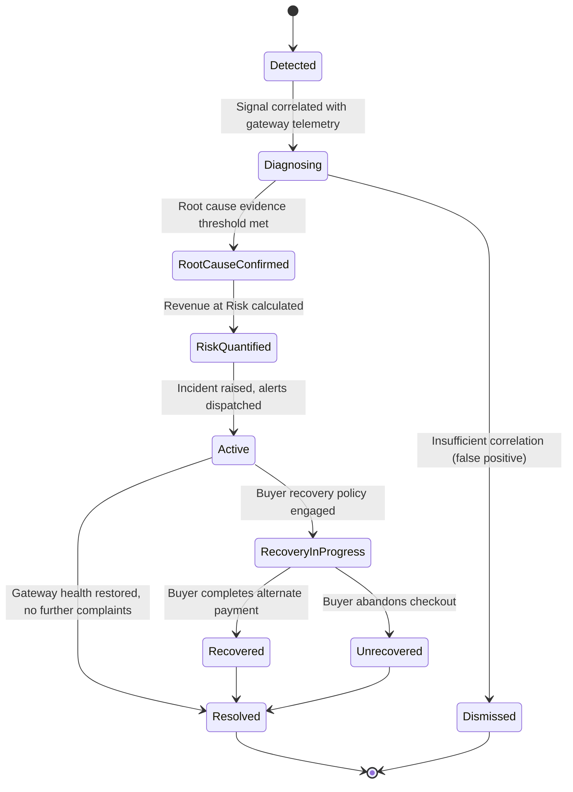

`Dismissed` exists as an explicit state rather than a silent no-op so that false-positive rate is a first-class, queryable metric — an important signal for tuning the Signal Intelligence Specialist's correlation threshold over time.

---

## Revenue at Risk Calculation Flow
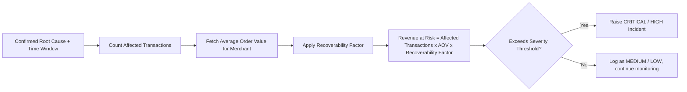

The **Recoverability Factor** represents the estimated proportion of affected transactions that can realistically be saved through intervention, given the failure type (a UPI timeout is highly recoverable via card fallback; a full gateway outage across all methods is not). This factor is currently a configurable constant per failure type, with a learned version planned — see [Roadmap](#roadmap).

---

## Recovery Policy Decision Flow
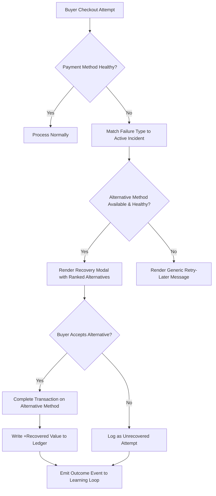

The ranking of alternatives shown in step F is policy-driven (see [Agentic Learning Loop](#agentic-learning-loop)) rather than a fixed priority list, so the first-recommended alternative can shift over time as outcome data accumulates.

---

## Agentic Learning Loop
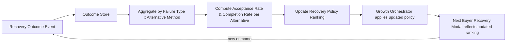

This closes the loop described in the six-stage cycle: the Learn stage does not simply archive outcomes for reporting, it directly changes which alternative payment method is recommended first for a given failure type, based on which alternatives have actually converted for buyers previously.

---

## Data Model
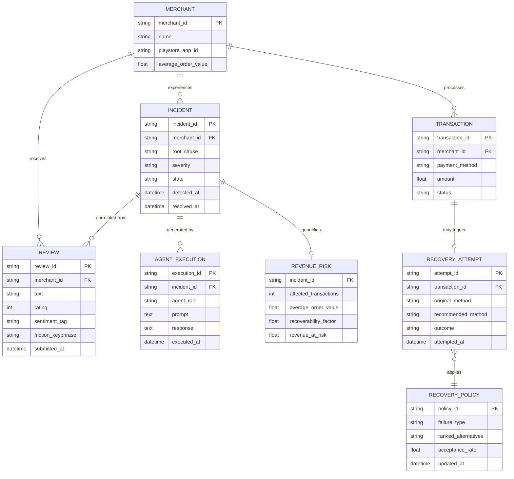

---

## Deployment Architecture
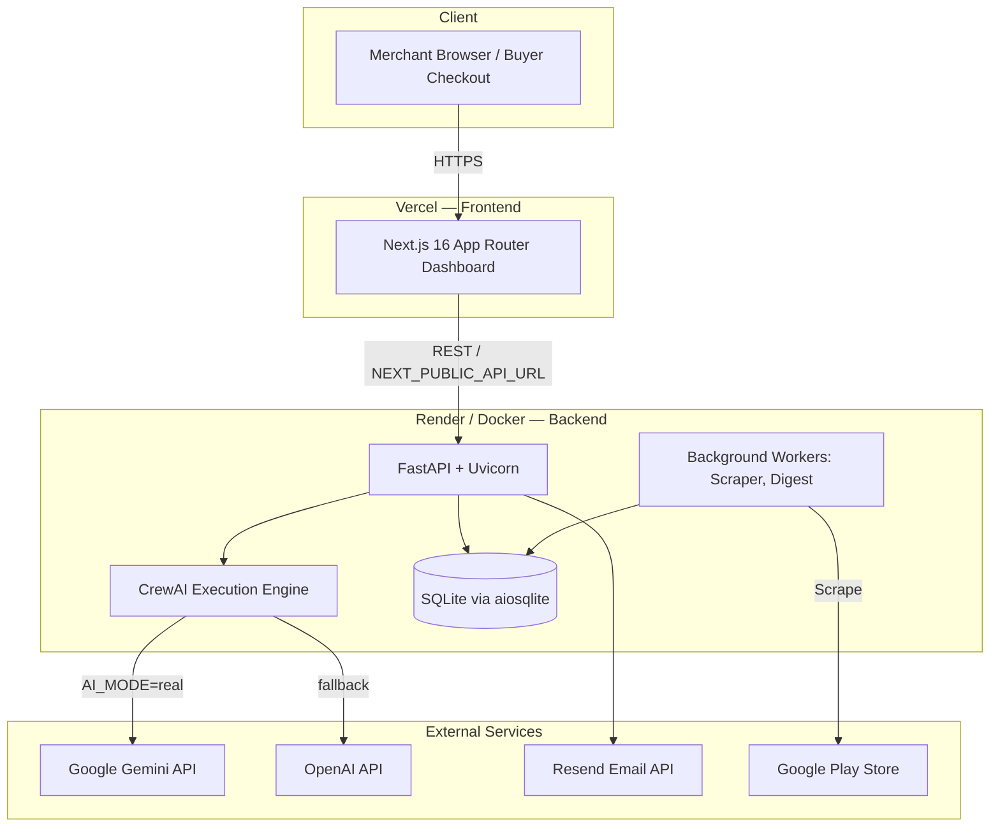

In `AI_MODE=mock`, the `Gemini` and `OpenAIAPI` external dependencies are bypassed entirely, allowing the full backend to run in a fully offline, self-contained environment.

---

## Key Functional Modules

### 1. Payment Reliability Incident Command Center
* Real-time monitoring of payment gateway health across UPI, Credit/Debit Cards, Net Banking, and Wallets.
* Automatic classification of incidents by severity (`CRITICAL`, `HIGH`, `MEDIUM`, `LOW`), driven by a composite score of complaint volume, gateway error rate, and revenue exposure.
* **Agent Execution History & Trace Inspector**: Provides full transparency into agent execution steps, detailing exact prompts, model responses, and state transitions without cluttering the main dashboard.
* Incident timeline view showing time-to-detect, time-to-diagnose, and time-to-recover for each incident, enabling post-incident review.

### 2. Autonomous Buyer Recovery Engine
* In-line intervention modal embedded directly into the checkout flow.
* Detects transaction failures (e.g., UPI bank gateway 504 timeouts) and recommends friction-free alternative payment channels (e.g., Credit/Debit Card).
* Direct conversion tracking recording recovered transaction value (`+₹4,999`) into the merchant ledger.
* Recovery strategy selection is policy-driven rather than hardcoded — the same failure type can route to different alternative payment methods depending on which alternatives are currently healthy.

### 3. Customer Signal & Review Intelligence
* Automated scraping and ingestion of Google Play Store reviews using `google-play-scraper`.
* Natural language categorization into sentiment tiers, rating distributions, and payment-related complaint flags.
* Ability to reset review caches and trigger real-time Play Store polling on demand.
* Keyphrase clustering surfaces recurring friction vectors (for example, repeated mentions of a specific bank name alongside "timeout" or "failed") so that emerging patterns are visible before they reach incident threshold.

### 4. Automated Email Alerting & Digest System
* Automated dispatch of critical incident warnings and daily feedback digests using Resend API and SMTP integration.
* Includes executive sentiment summaries, top recurring friction vectors, and recommended merchant actions.
* Digest cadence and severity thresholds for alerting are configurable per merchant, avoiding alert fatigue for low-severity fluctuations.

### 5. SLA & Revenue Churn Analytics
* Tracking of Mean Time to Detect (MTTD), Mean Time to Resolve (MTTR), and SLA compliance rates.
* Financial projections of revenue loss prevented through automated interventions.
* Historical trend view comparing revenue recovered by the autonomous engine against a baseline of unassisted checkout abandonment.

---

## Supporting Workflows
Beyond the primary detect-to-recover cycle, the platform runs several supporting workflows that keep the system self-sufficient during ongoing operation.

### Daily Digest Workflow
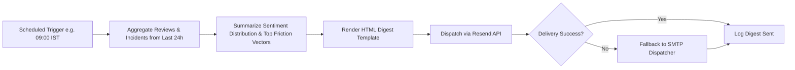

### Cold Start / Bootstrap Workflow


### Manual Override Workflow
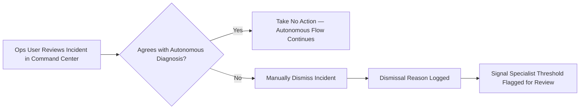

### Duplicate Incident Suppression Workflow
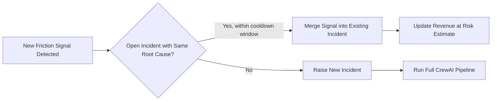

---

## Illustrative Workflow Walkthrough
The following narrative traces a single incident through the full six-stage cycle, corresponding to the sequence diagram above.

1. A buyer submits a one-star Play Store review: *"UPI timed out, money deducted!"* This is ingested by the scraper service within its next polling interval.
2. The Signal Intelligence Specialist agent classifies the review, extracting the friction vector `UPI_TIMEOUT` along with a severity tag based on language intensity and rating.
3. The Root Cause Diagnostician agent cross-references this friction vector against live gateway telemetry and confirms a correlated spike in UPI bank 504 timeouts.
4. The Revenue Risk Quantifier agent estimates the number of affected transactions over the current window, multiplies by average order value and a recoverability factor, and produces a quantified figure (for example, `INR 1,84,800`).
5. The Growth Orchestrator receives the confirmed diagnosis and risk figure, raises a structured incident in the Command Center, and triggers two parallel actions: a Resend email alert to merchant stakeholders, and activation of the recovery policy for the affected payment method.
6. When the next buyer attempts a UPI payment and encounters the simulated 504 timeout, the checkout modal — now operating under the active recovery policy — surfaces a recommended alternative ("Try Credit/Debit Card").
7. The buyer accepts, completes the transaction, and the recovered value is logged to the Recovered Revenue Ledger.
8. The outcome (successful recovery, chosen alternative, time elapsed) is fed back into the Agentic Learning Loop, informing which alternative is recommended first the next time this failure mode occurs.

---

## Modular LLM & Agent Fallback Provider
Merchant Pulse AI features a resilient, multi-tiered AI architecture designed for production deployment and offline hackathon evaluation:

1. **CrewAI Framework Engine**: Executes multi-agent tasks using `gemini/gemini-3.5-flash-lite` and OpenAI models.
2. **Native Provider Abstraction**: Direct API calls to Google Gemini (`google-generativeai`) or OpenAI (`openai`).
3. **Zero-Dependency Deterministic Fallback Mode (`AI_MODE=mock`)**: Guarantees complete test coverage and deterministic demo execution without external API key dependencies.

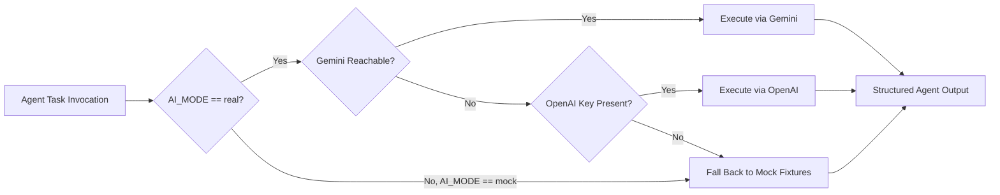

This tiered design means the platform can be evaluated end-to-end — including full agent reasoning traces — even in a network-restricted judging environment, by setting `AI_MODE=mock` and relying on deterministic fixture responses that exercise the same code paths as the live providers.

---

## Technology Stack
* **Frontend**: Next.js 16 (App Router), React 19, TypeScript, Vanilla CSS, Lucide React Icons, Recharts Analytics.
* **Backend**: Python 3.11+, FastAPI, Uvicorn, Async SQLAlchemy, SQLite (`aiosqlite`), Pydantic v2.
* **Agent Framework**: CrewAI, CrewStudio Telemetry & Enterprise Tracing.
* **LLM Engine**: Google Gemini 3.5 Flash, OpenAI GPT-4o / GPT-3.5.
* **External Integrations**: Resend Email API, `google-play-scraper`.

---

## Repository Structure
```
.
├── backend/
│   ├── agents/          # Native multi-agent implementations (Signal, Root Cause, Risk, Recovery)
│   ├── crew/            # CrewAI pipeline integration (crew_pipeline.py)
│   ├── providers/       # LLM provider abstractions (Gemini, OpenAI, Mock)
│   ├── routers/         # FastAPI REST endpoints (incidents, reviews, checkout, recovery, SLA)
│   ├── services/        # Scraper, Email, and Background workers
│   ├── main.py          # Application entrypoint
│   └── config.py        # Environment configuration
├── frontend/
│   ├── src/app/         # Next.js App Router pages (dashboard, incidents, signals, transactions)
│   ├── src/components/  # Layout, Navbar, and UI components
│   └── src/lib/         # API client utilities
├── .env.example         # Environment template
├── Dockerfile           # Backend container specification
├── Procfile             # Cloud deployment specification
└── README.md            # System documentation
```

---

## API Specification Overview
| Method | Endpoint | Description |
| :--- | :--- | :--- |
| `GET` | `/api/dashboard/stats` | Fetch real-time merchant KPIs, gateway health, and revenue stats. |
| `GET` | `/api/incidents` | List active payment reliability incidents and agent execution logs. |
| `POST` | `/api/checkout/simulate` | Simulate buyer checkout attempt and trigger recovery intervention. |
| `GET` | `/api/reviews` | List ingested Play Store reviews with sentiment filtering. |
| `POST` | `/api/reviews/fetch-live` | Trigger real-time Play Store review extraction. |
| `POST` | `/api/reviews/trigger-warning` | Manually dispatch critical Resend email warning alert. |
| `POST` | `/api/demo/reset` | Reset demo state, review cache, and incident history. |

---

## Environment Configuration
The following variables configure runtime behavior. A full template is provided in `.env.example`.

| Variable | Required | Description |
| :--- | :--- | :--- |
| `AI_MODE` | Yes | `real` to use live LLM providers, `mock` for deterministic offline execution. |
| `GEMINI_API_KEY` | If `AI_MODE=real` | API key for Google Gemini provider. |
| `OPENAI_API_KEY` | Optional | API key for OpenAI fallback provider. |
| `RESEND_API_KEY` | Yes (for email) | API key for Resend transactional email dispatch. |
| `SMTP_HOST` / `SMTP_PORT` / `SMTP_USER` / `SMTP_PASSWORD` | Optional | SMTP fallback if Resend is unavailable. |
| `DATABASE_URL` | No | Defaults to local SQLite via `aiosqlite`; override for a managed database. |
| `PLAYSTORE_APP_ID` | Yes | Google Play package identifier to scrape reviews from. |
| `NEXT_PUBLIC_API_URL` | Yes (frontend) | Base URL the frontend uses to reach the backend API. |

---

## Quickstart and Local Setup

### 1. Prerequisites
* Python 3.10+
* Node.js 18+

### 2. Backend Setup
```bash
# Navigate to backend directory
cd backend
# Install dependencies
pip install -r requirements.txt
# Start backend server
python main.py
```
The FastAPI backend server will initialize at `http://localhost:8000`.

### 3. Frontend Setup
```bash
# Navigate to frontend directory
cd frontend
# Install dependencies
npm install
# Start Next.js development server
npm run dev
```
The Next.js Merchant SaaS Dashboard will initialize at `http://localhost:3000`.

### 4. Running in Offline / Mock Mode
To evaluate the full pipeline without external API keys, set `AI_MODE=mock` in the backend `.env` file before starting the server. All CrewAI agents will execute against deterministic fixture logic, exercising the same orchestration, incident creation, and recovery paths as production mode.

---

## Production Deployment

### Backend (Render / Docker)
* **Build Command**: `pip install -r backend/requirements.txt`
* **Start Command**: `uvicorn backend.main:app --host 0.0.0.0 --port $PORT`
* **Environment Variables**: `PYTHONPATH=.`, `AI_MODE=real`, `GEMINI_API_KEY=<key>`, `RESEND_API_KEY=<key>`

### Frontend (Vercel)
* **Root Directory**: `frontend`
* **Build Command**: `npm run build`
* **Environment Variables**: `NEXT_PUBLIC_API_URL=https://<your-backend-url>/api`

---

## Reliability, Testing, and Observability
* **Deterministic fixture suite**: The mock provider mode doubles as a regression test harness — the same fixtures used for offline demos validate that agent orchestration and downstream side effects (incident creation, email dispatch, ledger writes) behave correctly without live API calls.
* **Agent Execution Trace**: Every agent invocation, its prompt, and its structured response are persisted and viewable in the Trace Inspector, supporting both debugging and post-incident audit.
* **Idempotent incident handling**: Duplicate friction signals for an already-open incident are merged rather than creating redundant incidents, preventing alert storms during sustained gateway degradation.
* **Graceful provider fallback**: If the primary LLM provider (Gemini) is unavailable, the system falls back to the OpenAI provider before falling back further to mock mode, minimizing pipeline downtime.

---

## Security and Data Handling Considerations
* Review text ingested from the Play Store is public data; no buyer personally identifiable information is extracted or stored beyond what is already public in the review.
* Checkout telemetry used in the current build is simulated for demonstration purposes; a production integration would consume gateway webhook events over authenticated channels rather than polling.
* API keys for LLM providers and Resend are read from environment variables only and are never logged, including within the Agent Execution Trace.
* The recovery modal never requests or stores raw payment credentials; it only recommends a payment method switch, with the actual transaction handled by the existing gateway integration.

---

## Known Limitations
* Checkout telemetry and gateway failure simulation are currently mocked for demonstration; production deployment requires a live gateway webhook integration (for example, Razorpay webhooks) in place of the simulated 504 timeout.
* Review polling latency is bounded by the Play Store scraping interval, which is the dominant contributor to MTTD; a push-based review notification source would reduce this further.
* The Recoverability Factor used in the Revenue at Risk formula is currently a configurable constant rather than a learned parameter; the Learn stage roadmap item below addresses this.
* Single-region SQLite storage is suitable for demo and small-merchant scale; horizontal scaling would require migrating to a managed relational database.

---

## Roadmap
* **Learned Recoverability Factor**: Replace the static recoverability constant with a model trained on historical recovery outcomes, per merchant and per failure type.
* **Multi-Channel Signal Ingestion**: Extend beyond Google Play Store reviews to Apple App Store reviews, support ticket systems, and social media mentions.
* **Live Gateway Webhook Integration**: Replace simulated checkout telemetry with authenticated Razorpay (or other PSP) webhook consumption for production-grade root cause correlation.
* **Merchant-Configurable Recovery Policies**: Allow merchants to define custom fallback payment method rankings rather than relying solely on the strategist agent's default policy.
* **Multi-Merchant Tenancy**: Extend the data model and dashboard to support multiple merchants with isolated incident histories and configuration.
* **A/B Testing of Recovery Copy**: Test variations of the checkout modal's recommended-action messaging to optimize buyer acceptance rate.

---

## Demo Script for Evaluators
A suggested walkthrough for judges evaluating the platform end-to-end:

1. Start both backend and frontend services with `AI_MODE=mock` for a fully offline, deterministic run.
2. From the Signals page, trigger `POST /api/reviews/fetch-live` (or use the on-screen "Fetch Live Reviews" action) to simulate a fresh batch of Play Store reviews, including at least one payment-friction review.
3. Observe the Incident Command Center as a new `CRITICAL` incident is autonomously raised, and open the Trace Inspector to review each agent's reasoning step.
4. Trigger `POST /api/checkout/simulate` (or use the on-screen checkout demo) to simulate a buyer encountering the same failure mode, and observe the Autonomous Buyer Recovery Modal recommending an alternative payment method.
5. Complete the simulated recovery and confirm the recovered transaction value appears in the Recovered Revenue Ledger and updates the SLA & Revenue Churn Analytics view.
6. Review the dispatched Resend email alert (or its logged payload in mock mode) to confirm the full Detect-to-Act loop executed autonomously.

---

## License
Built for the **Razorpay Hackathon** — *AI Growth & Agentic Commerce*.
